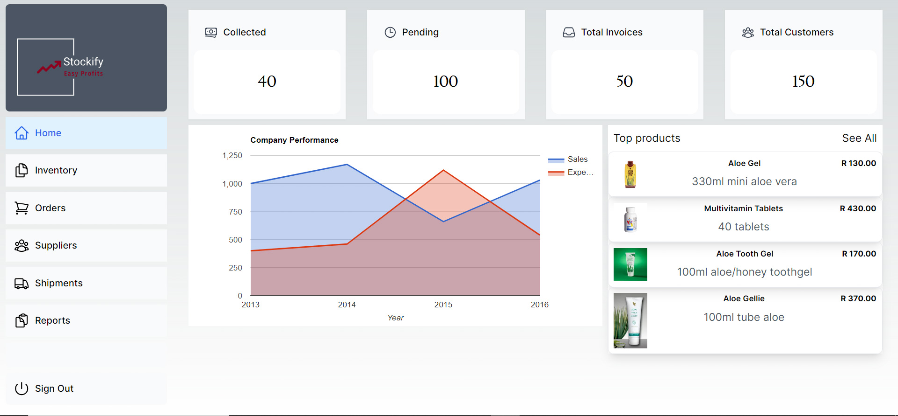
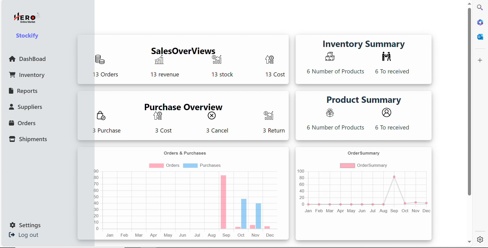

# Stock Management Application (Work in Progress)

## Description

After mastering the basics and building medium-sized websites, I craved a challenge that would push my skills from design through to deployment. My background in accounting, dealing with stock costing, reconciliation, and stock-outs, sparked an idea: create a stock management application to streamline these processes. This led to the development of an experimental app that uses the FIFO (First In, First Out) method for inventory management. The application revolutionizes how businesses track stock levels, manage orders, and maintain efficient inventory turnover.

## Build Process

The journey began with building the application using React and Node.js, complemented by MongoDB for its flexible data storage capabilities. MongoDB's ability to embed related data made it a perfect fit. To ensure a robust schema, I utilized Mongoose. As I delved into Next.js, I decided to migrate the application to leverage its powerful features like NextAuth, seamless routing, server-side rendering, and streaming. This transition not only enhanced the app's performance but also opened new avenues for scalability and user experience. Next.js also eliminated the need for a separate server codebase. This allowed me to leverage React Server Components for seamless database interactions.

## Challenges

I am no designer by any stretch of the imagination, so the initial web app was not aesthetically pleasing. As a result, I rebuilt the entire UI. One of the biggest challenges was developing algorithms to deduct ordered products from the relevant stock while maintaining the FIFO design. This required careful planning and testing to ensure accuracy and efficiency. Authentication was another significant challenge. I initially used a third-party package, but my implementation was flawed. Migrating to Next.js was the best decision as it is a full-fledged framework that comes with built-in authentication features.
### New Ui with Next Js framework

## Tech Stack

- Next.js
- Node.js
- React.js
- MongoDB
- Figma
- Google graphs
- Visual Studio Code

### Old Ui with Next Js framework

## Tech Stack

- Node
- React.js
- MongoDB
- Figma
- React graphs
- Visual Studio Code

## Links
- [NewSource Code in Next Js](https://github.com/McDonaldMusimwa/stockifynextjs.git)

- [Old Live Web App](https://stockify.heromarket.co.za/)
- [Old BackEnd Source Code](https://github.com/McDonaldMusimwa/InventorySystemTypescript)
- [Old FrontEnd SourceCode](https://github.com/McDonaldMusimwa/stockify.git)
